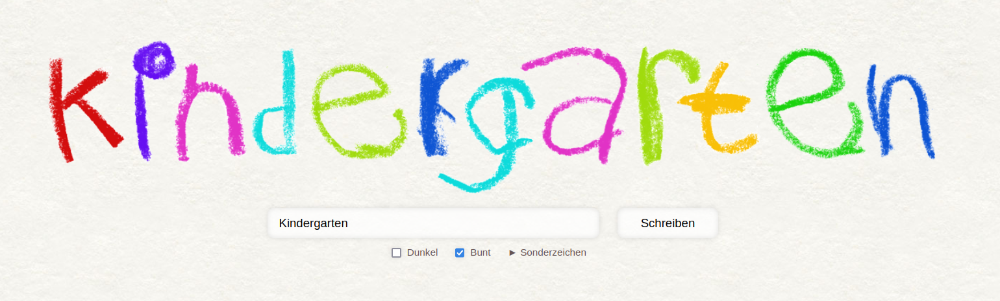

# Kindergarten typography

Serve a website that allows you to write text that looks like it was drawn by a kid using crayons.

## Adventures ahead

This is just an archive of very old code.
If you are bold enough trying to host this, tell me if you got it working.
The only reason I wanted to put it here is to kind of archive it in a half-assed way.

## Hosting

If you're still adventurous enough and want to try this out you should make sure that you have set `$useMySQL = false;`.
This then computes kerning on basic text files residing in `site/fonts/*.krn` using the counts of variations found in `site/fonts/*.var`.
While this is very slow, it works without having to set up an SQL server.

So, if you're even more adventurous you can set `$useMySQL = true;` and try the same with a much faster generation time.
For this to work you need to figure out how to convert the `.krn` and `.var` files into the format that is [implied by the query](https://github.com/flxai/kindergarten-typography/blob/main/site/index.php#L96-L102).

PRs are very welcome! ❤️
